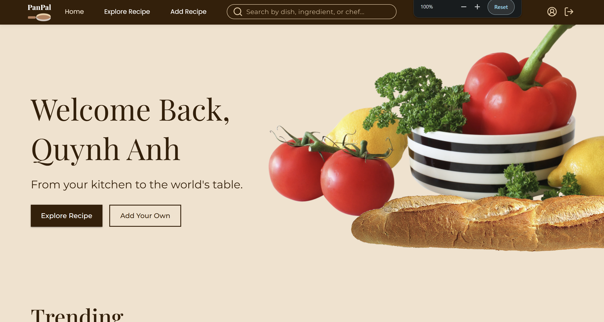
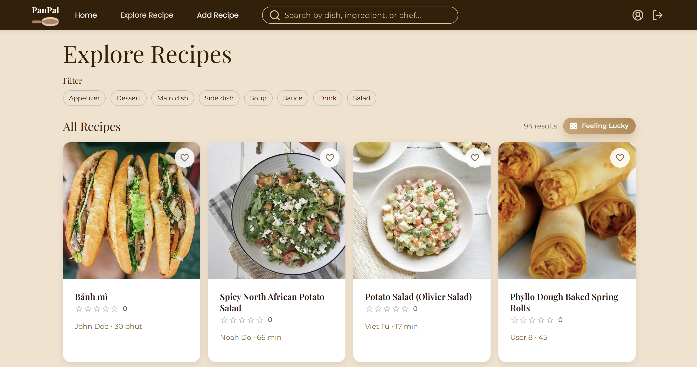
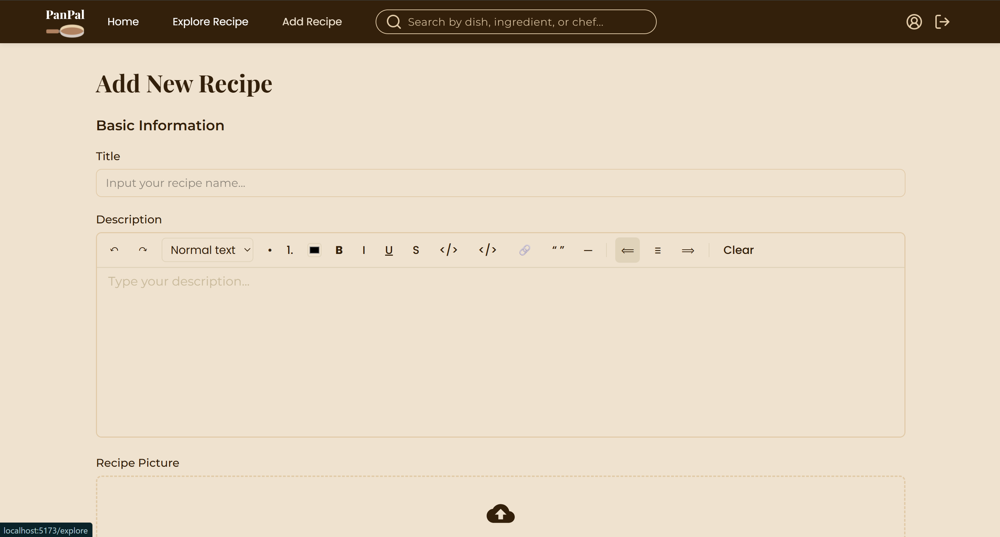
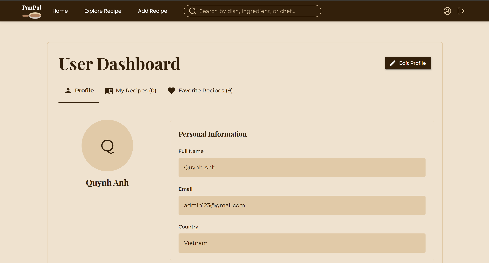

<header id="#header">
<p align="center" >
  <a name="header"></a>
  
</p>

<p  align="center" >
  A recipe sharing platform for food lovers and cooking enthusiasts.
</p>

<h1  align="center" >
  WeCamp Batch 8 - PanPal Frontend
</h1>
<p align="justify">
PanPal is a modern recipe sharing web application built with React, TypeScript, and Material-UI. This frontend application provides an intuitive interface for users to discover, create, and share delicious recipes with a vibrant cooking community. With features like user authentication, recipe management, advanced search and filtering, favorites system, step-by-step cooking instructions with images, and trending recipes, PanPal offers an engaging cooking experience for both beginners and professional chefs.
</p>

<p align="center" >
  
  
</p>
<p align="center" >
  
  
</p>
</header>

## 📋 Table of Contents

- [🍳 Features](#-features)
- [🛠️ Tech Stack](#️-tech-stack)
- [🚀 Getting Started](#-getting-started)
  - [Prerequisites](#prerequisites)
  - [Installation](#installation)
  - [Environment Variables](#environment-variables)
  - [Available Scripts](#available-scripts)
- [📁 Project Structure](#-project-structure)
- [🎨 Design System](#-design-system)
- [🔌 API Integration](#-api-integration)
- [📱 Screenshots](#-screenshots)
- [📦 Build & Deployment](#-build--deployment)
- [🤝 Contributing](#-contributing)
- [📄 License](#-license)
- [👥 Team](#-team)

## 🍳 Features

- **Recipe Management**: Create, edit, and delete your own recipes
- **Discovery**: Browse trending recipes and discover new favorites
- **Search & Filter**: Find recipes by ingredients, categories, or cooking time
- **Favorites System**: Save your favorite recipes for quick access
- **Step-by-Step Instructions**: Detailed cooking steps with optional images
- **User Profiles**: Manage your profile and view your recipe collection
- **Responsive Design**: Beautiful UI that works on all devices
- **Authentication**: Secure user registration and login with JWT
- **Image Upload**: Upload recipe and step images with preview
- **Real-time Notifications**: Toast notifications for user actions

## 🛠️ Tech Stack

- **Framework**: React 18 with TypeScript
- **UI Library**: Material-UI (MUI) v5
- **Routing**: React Router v6
- **State Management**: React Hooks & Context API
- **HTTP Client**: Axios
- **Notifications**: React Hot Toast
- **Icons**: Lucide React, Material-UI Icons
- **Date Handling**: date-fns
- **Styling**: Material-UI Theme System + Emotion
- **Build Tool**: Vite
- **Package Manager**: npm/yarn
- **Development**: ESLint, TypeScript

## 🚀 Getting Started

### Prerequisites

- Node.js (v16 or higher)
- npm or yarn
- Backend API server running (see backend repository)

### Installation

1. Clone the repository
```bash
git clone https://github.com/your-username/panpal-frontend.git
cd panpal-frontend
```

2. Install dependencies
```bash
npm install
```

3. Create environment file
```bash
cp .env.example .env.local
```

### Environment Variables

Create a `.env.local` file in the root directory:

```env
VITE_API_BASE_URL=http://localhost:3000/api
VITE_APP_NAME=PanPal
```

### Available Scripts

```bash
# Start development server
npm run dev

# Build for production
npm run build


## 📁 Project Structure

```
src/
├── components/          # Reusable UI components
│   ├── add-ingredients/ # Recipe ingredient management
│   ├── add-step/       # Recipe step management
│   ├── category-select/ # Category selection
│   ├── comment-card/   # Recipe comments
│   ├── confirm-dialog/ # Confirmation dialogs
│   ├── home-trending/  # Trending recipes section
│   ├── nav-bar/        # Navigation bar
│   ├── pop-up/         # Toast notifications
│   ├── protected/      # Protected route wrapper
│   ├── recipe-card/    # Recipe display card
│   ├── signIn-form/    # Login form
│   └── signUp-form/    # Registration form
├── pages/              # Page components
│   ├── add-recipe.tsx  # Create recipe page
│   ├── home.tsx        # Home page
│   ├── profile.tsx     # User profile page
│   └── recipe-detail.tsx # Recipe detail page
├── services/           # API services
│   ├── auth.ts         # Authentication API
│   ├── recipes.ts      # Recipe API
│   └── axiosClient.ts  # HTTP client configuration
├── hooks/              # Custom React hooks
│   └── useFavorites.ts # Favorites management
├── types/              # TypeScript type definitions
│   ├── ui-recipe.ts    # Recipe types
│   └── auth.ts         # Authentication types
├── utils/              # Utility functions
├── theme/              # Material-UI theme configuration
└── mocks/              # Mock data for development
```

## 🎨 Design System

PanPal uses a warm, cooking-inspired design system:

### Colors
- **Primary**: `#391F06` (Rich Brown)
- **Secondary**: `#f5e2cc` (Warm Cream)
- **Accent**: `#BFA980` (Light Brown)

### Typography
- **Headings**: Playfair Display (serif)
- **Body Text**: Montserrat (sans-serif)

### Components
- Consistent Material-UI theming
- Custom styled components
- Responsive breakpoints
- Consistent spacing and elevation

## 🔌 API Integration

The frontend communicates with the backend API using:

- **Axios**: HTTP client with interceptors
- **JWT Authentication**: Token-based authentication
- **Error Handling**: Centralized error handling with toast notifications
- **Loading States**: Loading indicators for async operations

### API Endpoints Used
- `/auth/login` - User authentication
- `/auth/register` - User registration
- `/recipes` - Recipe CRUD operations
- `/recipes/trending` - Trending recipes
- `/users/profile` - User profile management

## 📱 Screenshots

*Replace with actual screenshots of your application*


### Deployment Options

- **Vercel**: Connect your GitHub repository
- **Netlify**: Drag and drop the `dist` folder
- **GitHub Pages**: Use GitHub Actions for deployment
- **Docker**: Build and deploy using containers

## 🤝 Contributing

We welcome contributions! Please follow these steps:

1. Fork the repository
2. Create a feature branch (`git checkout -b feature/amazing-feature`)
3. Commit your changes (`git commit -m 'Add some amazing feature'`)
4. Push to the branch (`git push origin feature/amazing-feature`)
5. Open a Pull Request

### Development Guidelines

- Follow TypeScript best practices
- Use Material-UI components when possible
- Maintain consistent code formatting
- Write meaningful commit messages
- Test your changes thoroughly

## 📄 License

This project is licensed under the MIT License - see the [LICENSE](LICENSE) file for details.

## 👥 Team

WeCamp Batch 8 - Team PanPal Frontend


---

<p align="center">
  Made with ❤️ and 🍳 by the PanPal team
</p>

<p align="center">
  <a href="#header">Back to top ⬆️</a>
</p>
